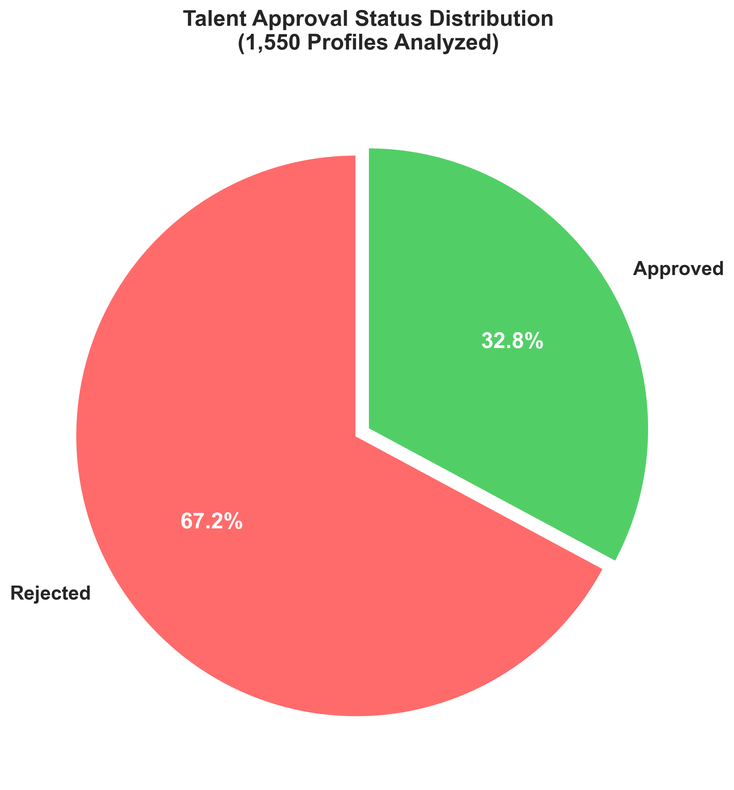
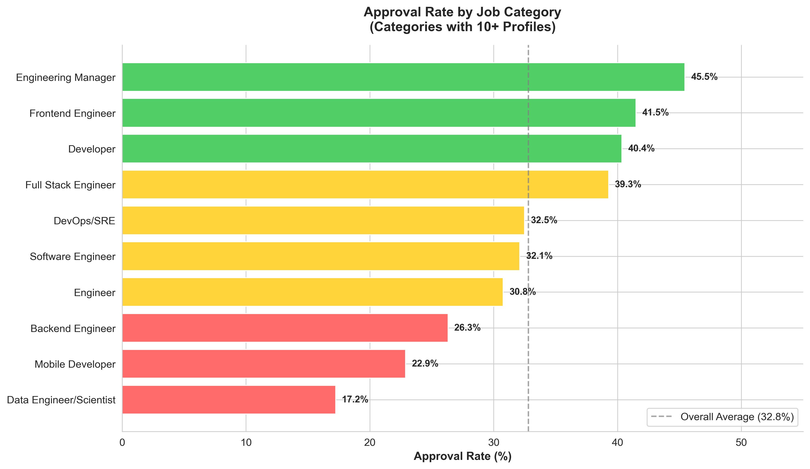
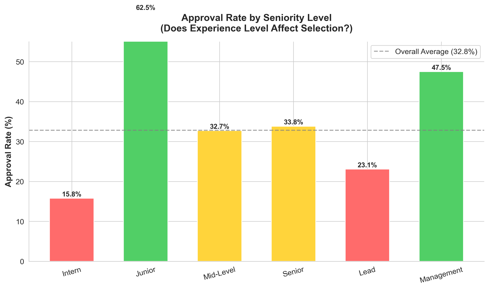
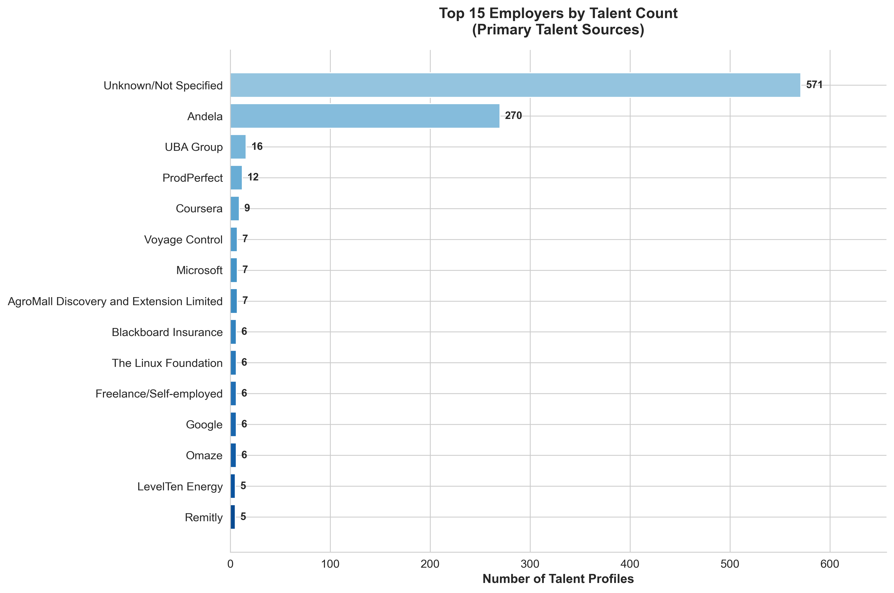
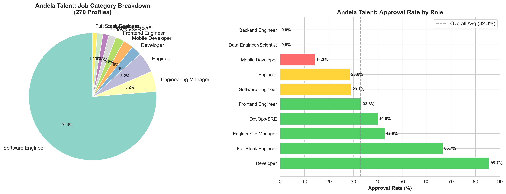
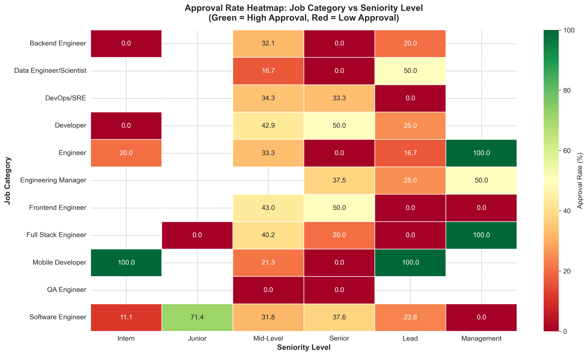

# 🎯 Talent Acquisition Analytics

> **Data-driven insights to optimize tech talent recruitment pipeline**

[](https://python.org)
[](https://pandas.pydata.org)
[](LICENSE)

---

## 📌 Table of Contents

- [Business Problem](#business-problem)
- [The Answer](#the-answer)
- [Dataset](#dataset)
- [Key Findings](#key-findings)
  - [Pipeline Health](#1-overall-pipeline-health)
  - [Job Category](#2-job-category-performance)
  - [Seniority Impact](#3-seniority-level-is-the-strongest-predictor)
  - [Talent Source](#4-talent-source-concentration-risk)
  - [Andela Deep Dive](#5-andela-specific-insights)
  - [Category vs Seniority](#6-approval-heatmap)
- [Technologies Used](#technologies-used)
- [Project Structure](#project-structure)
- [Quick Start](#quick-start)
- [Key Insight](#key-insight)
- [Recommendations](#recommendations)
- [Author](#author)

---

## 🎯 Business Problem

**"What factors drive talent approval decisions, and how can we optimize our recruitment pipeline to improve approval rates and quality of hire?"**

A tech talent acquisition platform processed **1,550 candidate profiles** but achieved only a **32.8% approval rate**. This project digs into the data to uncover *why* — and what to do about it.

---

## 💡 The Answer

> *"I analyzed 1,550 tech talent profiles to understand why only 33% were approved. I discovered that **Engineering Managers lead at 45.5% approval**, while **Data Engineers/Scientists trail at 17.2%**. Frontend Engineers (41.5%) and Developers (40.4%) also outperform the average. My recommendation: double down on high-performing categories and investigate why Data & Mobile roles underperform. I built this using Python, Pandas, and regex for text extraction, with Matplotlib/Seaborn for visualization."*

---

## 📁 Dataset

| Feature | Description | Type |
|---------|-------------|------|
| `URL` | LinkedIn profile link | String |
| `First_Name` | Candidate first name | String |
| `Last_Name` | Candidate last name | String |
| `Job_Title` | Full job description | String |
| `Status` | Approval decision (Approved / Rejected) | Categorical |

- **Size:** 1,550 rows × 5 columns
- **Source:** [`data/raw_data.xlsx`](data/raw_data.xlsx)

**Engineered Features:**
- `Employer_Name` — Extracted company from job title via regex
- `Job_Category` — Standardized role classification
- `Seniority_Level` — Experience level classification

---

## 🔑 Key Findings

### 1. Overall Pipeline Health

Only **32.8%** of candidates are approved (509 approved / 1,041 rejected). This suggests either highly selective criteria or pipeline inefficiencies that need investigation.



---

### 2. Job Category Performance

| Category | Approval Rate | Insight |
|----------|--------------|---------|
| **Engineering Manager** | **45.5%** ⭐ | Highest approval — leadership roles in demand |
| Frontend Engineer | 41.5% | Strong UI/UX talent pipeline |
| Developer | 40.4% | Generalist developers perform well |
| Full Stack Engineer | 39.3% | Versatile skill set valued |
| DevOps/SRE | 32.5% | Right at overall average |
| Software Engineer | 32.1% | Baseline performance |
| Engineer | 30.8% | Slightly below average |
| Backend Engineer | 26.3% | Room for improvement |
| Mobile Developer | 22.9% | Review screening criteria |
| Data Engineer/Scientist | **17.2%** ⚠️ | Lowest — investigate skill gap |



**🔍 Insight:** Leadership and frontend-facing roles outperform backend and data roles. Data Engineers/Scientists have the lowest approval rate — suggesting either a skill mismatch or overly strict criteria for data roles.

---

### 3. Seniority Level is the Strongest Predictor

| Level | Approval Rate | Insight |
|-------|--------------|---------|
| **Junior** | **62.5%** ⭐ | Nearly 2× the average — invest here |
| Management | 47.5% | Strong leadership pipeline |
| Senior | 33.8% | Around average |
| Mid-Level | 32.7% | Average performance |
| **Lead** | **23.1%** ⚠️ | Lowest — investigate criteria mismatch |
| Intern | 15.8% | Entry-level screening may be too strict |



**🔍 Insight:** Junior talent is preferred — suggesting the company has training/mentorship capacity. Senior and Lead roles face stricter requirements.

---

### 4. Talent Source Concentration Risk

- **Andela** provides 17.4% of all talent (270 profiles)
- **36.8%** of profiles have no identifiable employer
- Heavy reliance on a single source creates vulnerability



---

### 5. Andela-Specific Insights

- Andela overall: **33.0%** approval (right at average)
- Andela Full Stack Engineers: **66.7%** approval (2× better than average!)
- Andela Developers: **85.7%** approval (small sample: 7 profiles)
- Andela Backend/Data roles: **0%** approval — concerning skill gap



---

### 6. Approval Heatmap

The intersection of **Job Category × Seniority Level** reveals where the pipeline wins and where it breaks.



---

## 🛠 Technologies Used

| Tool | Purpose |
|------|---------|
| **Python** | Primary programming language |
| **Pandas** | Data manipulation & analysis |
| **NumPy** | Numerical computations |
| **Matplotlib** | Static visualizations |
| **Seaborn** | Statistical visualizations |
| **Regex** | Text pattern extraction from unstructured job titles |

---

## 📂 Project Structure

```
talent-acquisition-analytics/
│
├── 📁 data/
│   ├── raw_data.xlsx                    # Original dataset
│   └── talent_data_cleaned.csv          # Cleaned output
│
├── 📁 notebooks/
│   └── 01_talent_analysis.ipynb         # Full analysis notebook
│
├── 📁 images/                           # Generated visualizations
│   ├── 01_approval_status_pie.png
│   ├── 02_top_employers_bar.png
│   ├── 03_approval_by_job_category.png
│   ├── 04_approval_by_seniority.png
│   ├── 05_andela_deep_dive.png
│   └── 06_heatmap_category_seniority.png
│
├── 📄 README.md                         # This file
├── 📄 requirements.txt                  # Python dependencies
└── 📄 LICENSE                           # MIT License
```

---

## ⚡ Quick Start

```bash
# 1. Clone the repo
git clone https://github.com/YOUR_USERNAME/talent-acquisition-analytics.git
cd talent-acquisition-analytics

# 2. Create virtual environment
python -m venv venv

# Windows
venv\Scripts\activate
# Mac/Linux
source venv/bin/activate

# 3. Install dependencies
pip install -r requirements.txt

# 4. Launch the notebook
jupyter notebook notebooks/01_talent_analysis.ipynb
```

---

## 🧠 Key Insight

One line of regex turned messy job titles into structured employer data:

```python
import re

def extract_employer(job_title):
    match = re.search(
        r'(?:\bat\b|\B@\b)\s+([^|,;()]+?)(?:\s*[|,;()]|$)',
        str(job_title),
        re.IGNORECASE
    )
    return match.group(1).strip() if match else 'Unknown/Not Specified'
```

This single function unlocked the **talent source analysis** that revealed Andela's 17.4% dominance and the 36.8% "unknown employer" data gap.

---

## 💡 Recommendations

| Priority | Action | Expected Impact |
|----------|--------|-----------------|
| 🔴 **High** | Prioritize Engineering Manager & Frontend candidates (40%+) | +7pp overall approval rate |
| 🔴 **High** | Investigate Data Engineer rejections (17.2%) | Fix skill gap or criteria |
| 🔴 **High** | Diversify from Andela (17.4% → <10%) | Reduce single-source risk |
| 🟡 **Medium** | Investigate Lead rejections (23.1%) | Fix criteria mismatch |
| 🟡 **Medium** | Add mandatory employer field | Improve data quality |
| 🟢 **Low** | Build predictive scoring model | Faster, fairer screening |

**Bottom line:** Shifting pipeline volume from low-performing segments (Data, Mobile, Backend) to high-performing ones (Engineering Manager, Frontend, Developer) could push the overall approval rate from **32.8% toward 40%**.

---

## 👤 Author

**[Favour Ibe]**
- 🐍 Python | Pandas | Data Analytics | Regex
- 🔗 [LinkedIn](your-linkedin-url) | [Portfolio](your-portfolio-url)

---

## 📄 License

This project is licensed under the [MIT License](LICENSE).

---

> *"Data-driven decisions turn recruitment from guesswork into science."*
